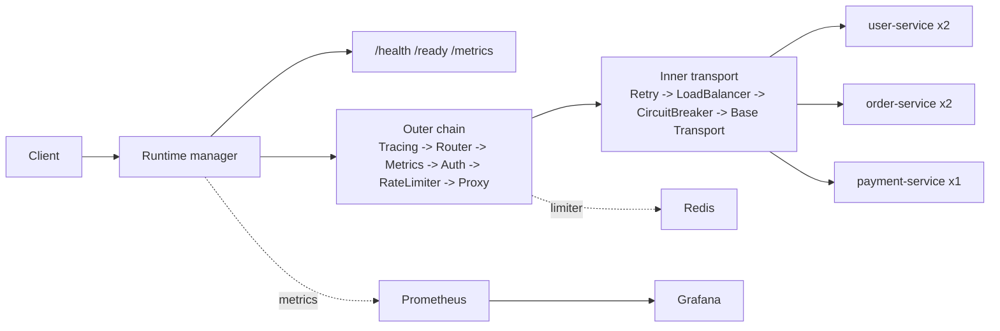

# IronGate

IronGate is a production-grade API gateway implemented in Go with the standard `net/http` stack. In one repository it combines config-driven routing, JWT authentication, Redis-backed sliding-window rate limiting, retry, load balancing, circuit breaking, Prometheus/Grafana observability, OpenTelemetry tracing hooks, hot reload, graceful shutdown, and a documented production deployment path.

The project is built for fast evaluation. You can run the complete stack locally, inspect the full request path across public and protected routes, and deploy the same architecture behind TLS without introducing a managed control plane or a large platform dependency.

Phases 1 through 8 plus Phase 9 Milestones 1 and 2 are now part of the repo's shipped runtime. The remaining Chaos Observatory expansion lives under [`docs/phase9-planning/`](./docs/phase9-planning/) and still describes future work beyond the current implementation.

## Start Here

- `./demo.sh` is the fastest way to evaluate the project.
- It starts the full stack, waits for `/ready`, logs in, exercises protected routes, samples `/metrics`, and tears the stack down on exit.
- Use `./demo.sh --keep-stack` if you want the services left running for manual inspection afterward.
- You do not need Go, Redis, Prometheus, or Grafana installed locally for the demo path.
- Run `./demo.sh --help` to see the available walkthrough flags.

## Prerequisites

- `git`
- Docker Desktop, or Docker Engine with the Compose plugin
- `curl`
- `make`
- `mise`

Optional:

- `python3`

## Quick Start

```bash
git clone https://github.com/hitesh07082002/IronGate.git
cd IronGate
mise install
./demo.sh
```

`mise install` installs the project-pinned `k6` toolchain from [`mise.toml`](./mise.toml).

`./demo.sh` starts the stack, waits for `/ready`, mints a demo token, exercises protected routes, samples `/metrics`, runs the smoke test, and tears the stack down when it exits.

The first run can take a minute or two while Docker builds the images.

Success looks like:
- you see JSON output from `/health` and `/ready`
- protected routes return real mock data
- the script ends with `Demo completed successfully.`

If you want to keep the stack running after the walkthrough so you can inspect it:

```bash
./demo.sh --keep-stack
```

That leaves these local URLs available:

- gateway: `http://127.0.0.1:8080`
- Prometheus: `http://127.0.0.1:9090`
- Grafana: `http://127.0.0.1:3000` with `admin/admin`

When you are done inspecting the stack:

```bash
./demo.sh --teardown
```

Run the same smoke benchmark later, with the local stack still running:

- start it with `./demo.sh --keep-stack`, or
- run `docker compose up -d --build`

```bash
make load-test
```

Need the full curl-based path instead of `./demo.sh`? Use [`docs/demo-walkthrough.md`](./docs/demo-walkthrough.md).

## Production Deployment

Production for this repo is intentionally simple:

- public traffic terminates at `https://irongate.hiteshsadhwani.xyz`
- only `80/443` are exposed publicly
- the gateway listens on `127.0.0.1:8080` in production
- Caddy terminates TLS and blocks public `/metrics`

Bootstrap the host once with root access:

```bash
make bootstrap-production
```

Deploy the committed `HEAD` from `main`:

```bash
make deploy-production
```

Run the production smoke check without redeploying:

```bash
make check-production
```

After bootstrap, day-to-day deploys use the dedicated `irongate` deploy user by default. The full operator workflow, safety rails, and release layout live in [`deploy/README.md`](./deploy/README.md).

## What IronGate Includes

- Config-driven longest-prefix routing with per-route method allowlists
- JWT auth with explicit `HS256` enforcement and sanitized identity headers
- Redis-backed sliding-window rate limiting with fail-open behavior on Redis outages
- Retry with exponential backoff and full jitter for idempotent methods
- Round-robin, weighted round-robin, and least-connections load balancing
- Per-target circuit breaking with failover and half-open recovery
- Prometheus metrics plus Grafana dashboards with service-only label cardinality
- OpenTelemetry trace export, W3C trace propagation, and Prometheus exemplars through the observatory overlay
- Chaos Observatory backend core with a local `:9000` control plane, SSE event stream, scenario runner, and Toxiproxy-backed Redis fault injection
- Bearer-protected admin reset endpoint for circuit-breaker state recovery during observatory demos
- Hot reload with rollback to the last valid runtime snapshot
- Graceful shutdown that flips `/ready` before draining in-flight requests

## Architecture



## Verification

```bash
make lint
make build
IRONGATE_TEST_REDIS_ADDR=127.0.0.1:6379 make test
IRONGATE_TEST_REDIS_ADDR=127.0.0.1:6379 make test-race
IRONGATE_TEST_REDIS_ADDR=127.0.0.1:6379 make coverage
make benchmark-test
```

If you want to reproduce the benchmark suite:

```bash
make benchmark
```

`make benchmark` writes a timestamped result bundle under `benchmarks/results/`.
The committed benchmark snapshot and performance notes live in [`docs/benchmarks.md`](./docs/benchmarks.md).

For the Phase 9 observability and observatory stack:

```bash
JWT_SECRET=test-secret \
GRAFANA_ADMIN_USER=admin \
GRAFANA_ADMIN_PASSWORD=admin \
ADMIN_TOKEN=admin-token \
DEMO_TOKEN=demo-token \
make observatory-up
```

That overlay adds Tempo, the OTel Collector, Toxiproxy, and the local observatory service on top of the normal Docker stack so you can verify live traces, Prometheus exemplars, scenario events, and Redis fault handling. It also enables the bearer-protected admin reset plane inside Docker via `ADMIN_TOKEN` without publishing a host admin port.

Once the overlay is up, these local URLs are useful:

- gateway: `http://127.0.0.1:8080`
- Grafana: `http://127.0.0.1:3000` with `admin/admin`
- observatory API: `http://127.0.0.1:9000/api/health`
- observatory SSE events: `http://127.0.0.1:9000/api/events`

Reset the observatory state through the public demo API:

```bash
DEMO_TOKEN=demo-token make observatory-reset
```

Start the built-in circuit-breaker recovery scenario:

```bash
curl -fsS -X POST \
  -H "Authorization: Bearer demo-token" \
  -H "Content-Type: application/json" \
  -d '{"intensity":"severe","duration":60}' \
  http://127.0.0.1:9000/api/scenarios/circuit-breaker-recovery/run
```

Tear the overlay down with:

```bash
JWT_SECRET=test-secret \
GRAFANA_ADMIN_USER=admin \
GRAFANA_ADMIN_PASSWORD=admin \
ADMIN_TOKEN=admin-token \
DEMO_TOKEN=demo-token \
make observatory-down
```

## Demo Capture

For a shareable terminal transcript or video, use [`scripts/capture-demo.sh`](./scripts/capture-demo.sh). Full capture instructions live in [`artifacts/demo/README.md`](./artifacts/demo/README.md).

## Troubleshooting

Local troubleshooting lives in [`docs/troubleshooting.md`](./docs/troubleshooting.md).
Production troubleshooting stays in [`deploy/README.md`](./deploy/README.md).

## Docs Map

- [`ARCHITECTURE.md`](./ARCHITECTURE.md): current runtime and code-reference guide
- [`PROJECT_SPEC.md`](./PROJECT_SPEC.md): full project scope and success criteria
- [`DESIGN_DOC.md`](./DESIGN_DOC.md): target-state design and algorithms
- [`PROGRESS.md`](./PROGRESS.md): shipped phases and open stretch goals
- [`docs/demo-walkthrough.md`](./docs/demo-walkthrough.md): manual local walkthrough and inspection path
- [`docs/benchmarks.md`](./docs/benchmarks.md): benchmark commands, committed snapshot, and performance notes
- [`docs/troubleshooting.md`](./docs/troubleshooting.md): local troubleshooting and common demo-path fixes
- [`docs/phase9-planning/PHASE9_CHAOS_OBSERVATORY_SPEC_v2.2.md`](./docs/phase9-planning/PHASE9_CHAOS_OBSERVATORY_SPEC_v2.2.md): approved Phase 9 planning spec
- [`docs/phase9-planning/PHASE9_IMPLEMENTATION_PLAN_v1.2.md`](./docs/phase9-planning/PHASE9_IMPLEMENTATION_PLAN_v1.2.md): ordered Phase 9 implementation plan
- [`docs/phase9-planning/DECISIONS_LOCK.md`](./docs/phase9-planning/DECISIONS_LOCK.md): locked Phase 9 implementation decisions
- [`docs/phase9-planning/CODEX_M2_PROMPT.md`](./docs/phase9-planning/CODEX_M2_PROMPT.md): implementation prompt used for the shipped M2 backend core
- [`ADR/`](./ADR/): architectural decisions and tradeoffs
- [`deploy/README.md`](./deploy/README.md): production bootstrap, deploy, and health-check flow
