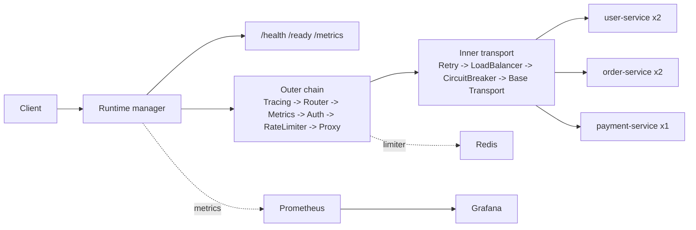

# IronGate

IronGate is a production-style API gateway built from scratch in Go with the standard `net/http` stack. It routes traffic from a single YAML config file and layers in JWT authentication, Redis-backed sliding-window rate limiting, retry, load balancing, circuit breaking, Prometheus metrics, hot reload, readiness draining, and graceful shutdown.

This branch closes out the documentation-and-evidence phase. The repo now includes a runnable benchmark suite, recorded benchmark artifacts, a polished quick-start path, ADRs, and a reproducible demo-capture workflow.

## Feature Overview

- Config-driven longest-prefix routing with per-route method allowlists
- JWT auth with explicit `HS256` enforcement and sanitized identity headers
- Redis-backed sliding-window rate limiting with fail-open behavior on Redis outages
- Retry with exponential backoff and full jitter for idempotent methods
- Round-robin, weighted round-robin, and least-connections load balancing
- Per-target circuit breaking with failover and half-open recovery
- Prometheus metrics plus Grafana dashboards with service-only label cardinality
- Hot reload with rollback to the last valid runtime snapshot
- Graceful shutdown that flips `/ready` before draining in-flight requests

## Architecture



Deeper implementation notes live in [`ARCHITECTURE.md`](./ARCHITECTURE.md), [`DESIGN_DOC.md`](./DESIGN_DOC.md), and [`ADR/`](./ADR/).

## Quick Start

### Fastest path

```bash
./demo.sh
```

`demo.sh` bootstraps the local stack, waits for `/ready`, issues a login token, exercises protected user, order, and payment routes, samples `/metrics`, and finishes with the k6 smoke test.

### Manual stack

```bash
export JWT_SECRET=demo-secret
export GRAFANA_ADMIN_USER=admin
export GRAFANA_ADMIN_PASSWORD=admin

docker-compose up -d --build
curl -fsS http://127.0.0.1:8080/ready
curl -fsS -X POST http://127.0.0.1:8080/api/users/login
```

## Verification

Run the full repo verification contract:

```bash
make lint
make build
IRONGATE_TEST_REDIS_ADDR=127.0.0.1:6379 make test
IRONGATE_TEST_REDIS_ADDR=127.0.0.1:6379 make test-race
IRONGATE_TEST_REDIS_ADDR=127.0.0.1:6379 make coverage
mise x k6@1.7.1 -- make benchmark
```

`make benchmark` writes a timestamped result bundle under `benchmarks/results/`.

## Demo Flow

The under-five-minute demo path is:

1. `./demo.sh`
2. health and readiness checks from the gateway
3. a fresh JWT login token from `/api/users/login`
4. protected `/api/users`, `/api/orders`, and `/api/payments/p-1` requests
5. a `/metrics` sample plus the k6 smoke test

The 2-minute capture workflow is scripted in [`scripts/capture-demo.sh`](./scripts/capture-demo.sh). Generated transcripts and optional MP4/GIF outputs live under [`artifacts/demo/`](./artifacts/demo/README.md); large binaries are intentionally not committed.

## Benchmark Summary

Recorded benchmark bundle: [`benchmarks/results/20260406-033854-d1edb38/`](./benchmarks/results/20260406-033854-d1edb38/README.md)

Environment note for the committed run:

- Apple M4, 10 logical CPU cores, 16 GB RAM
- `k6 v1.7.1`
- Docker Compose `v2.35.1`
- Go `1.24.4`

Main scenario highlights from that run:

| Scenario | Contract | Result |
|---|---|---:|
| Baseline public routing | `POST /api/users/login`, 24 VUs, 20s, distributed client IPs | `3799.53 req/s`, `p50 4.82 ms`, `p95 12.90 ms`, `p99 31.96 ms` |
| Authenticated + rate-limited traffic | `GET /api/payments/p-1`, 8 VUs, 20s, single authenticated identity | `111,042` rate-limited `429` responses after the first `20` successful requests |
| Full pipeline under normal conditions | `GET /api/orders`, 24 VUs, 20s, 1024 authenticated demo users, 100 ms pacing | `230.15 req/s`, `p50 2.92 ms`, `p95 6.47 ms`, `p99 11.08 ms` |

Circuit-breaker proof artifact:

- [`benchmarks/results/20260406-033854-d1edb38/circuit-breaker-transition-recovery/circuit-breaker-behavior.svg`](./benchmarks/results/20260406-033854-d1edb38/circuit-breaker-transition-recovery/circuit-breaker-behavior.svg)
- Healthy: `8x 200`
- Failure trip: `5x 500`, then `3x 503`
- Open circuit: `4x 503`
- Recovery after timeout: `5x 200`

Benchmark note: the local benchmark stack sets `IRONGATE_TRUSTED_PROXIES=0.0.0.0/0,::/0` so one host can emulate many client IPs through `X-Forwarded-For`. That is a benchmark-only local setting. The default runtime still trusts no proxies unless explicitly configured.

## Docs And ADRs

- [`ARCHITECTURE.md`](./ARCHITECTURE.md): current-runtime source of truth
- [`PROJECT_SPEC.md`](./PROJECT_SPEC.md): full project scope, success criteria, and deployment plan
- [`DESIGN_DOC.md`](./DESIGN_DOC.md): target architecture, algorithms, and failure-mode reasoning
- [`PROGRESS.md`](./PROGRESS.md): phase tracker reconciled to the current branch
- [`ADR/001-two-tier-pipeline.md`](./ADR/001-two-tier-pipeline.md)
- [`ADR/002-auth-before-rate-limiting.md`](./ADR/002-auth-before-rate-limiting.md)
- [`ADR/003-fail-open-rate-limiting.md`](./ADR/003-fail-open-rate-limiting.md)
- [`ADR/004-per-route-auth-not-global-public-paths.md`](./ADR/004-per-route-auth-not-global-public-paths.md)
- [`ADR/005-sliding-window-over-token-bucket.md`](./ADR/005-sliding-window-over-token-bucket.md)
- [`ADR/006-in-memory-least-connections.md`](./ADR/006-in-memory-least-connections.md)
- [`ADR/007-context-for-route-config.md`](./ADR/007-context-for-route-config.md)
- [`ADR/008-standard-middleware-interface.md`](./ADR/008-standard-middleware-interface.md)
