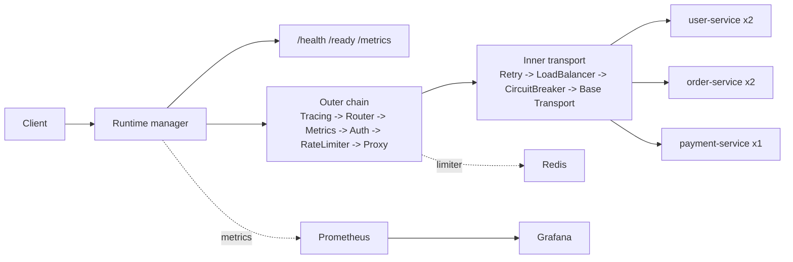

# IronGate

IronGate is a production-grade API gateway implemented in Go with the standard `net/http` stack. In one repository it combines config-driven routing, JWT authentication, Redis-backed sliding-window rate limiting, retry, load balancing, circuit breaking, Prometheus/Grafana observability, hot reload, graceful shutdown, and a documented production deployment path.

The project is built for fast evaluation. You can run the complete stack locally, inspect the full request path across public and protected routes, and deploy the same architecture behind TLS without introducing a managed control plane or a large platform dependency.

Phase 8 is the shipped baseline on `main`. The planned Phase 9 Chaos Observatory expansion lives under [`docs/phase9-planning/`](./docs/phase9-planning/) and does not describe current live behavior yet.

## Start Here

- `./demo.sh` is the fastest way to evaluate the project.
- It starts the full stack, waits for `/ready`, logs in, exercises protected routes, samples `/metrics`, and tears the stack down on exit.
- Use `./demo.sh --keep-stack` if you want the services left running for manual inspection afterward.
- You do not need Go, Redis, Prometheus, or Grafana installed locally for the demo path.
- Run `./demo.sh --help` to see the available walkthrough flags.

## Prerequisites

- `git`
- Docker Desktop, or Docker Engine with the Compose plugin
- `curl`
- `make`
- `mise`

Optional:

- `python3`

## Quick Start

```bash
git clone https://github.com/hitesh07082002/IronGate.git
cd IronGate
mise install
./demo.sh
```

`mise install` installs the project-pinned `k6` toolchain from [`mise.toml`](./mise.toml).

`./demo.sh` starts the stack, waits for `/ready`, mints a demo token, exercises protected routes, samples `/metrics`, runs the smoke test, and tears the stack down when it exits.

The first run can take a minute or two while Docker builds the images.

Success looks like:
- you see JSON output from `/health` and `/ready`
- protected routes return real mock data
- the script ends with `Demo completed successfully.`

If you want to keep the stack running after the walkthrough so you can inspect it:

```bash
./demo.sh --keep-stack
```

That leaves these local URLs available:

- gateway: `http://127.0.0.1:8080`
- Prometheus: `http://127.0.0.1:9090`
- Grafana: `http://127.0.0.1:3000` with `admin/admin`

When you are done inspecting the stack:

```bash
./demo.sh --teardown
```

Run the same smoke benchmark later, with the local stack still running:

- start it with `./demo.sh --keep-stack`, or
- run `docker compose up -d --build`

```bash
make load-test
```

## Production Deployment

Production for this repo is intentionally simple:

- public traffic terminates at `https://irongate.hiteshsadhwani.xyz`
- only `80/443` are exposed publicly
- the gateway listens on `127.0.0.1:8080` in production
- Caddy terminates TLS and blocks public `/metrics`

Bootstrap the host once with root access:

```bash
make bootstrap-production
```

Deploy the committed `HEAD` from `main`:

```bash
make deploy-production
```

Run the production smoke check without redeploying:

```bash
make check-production
```

After bootstrap, day-to-day deploys use the dedicated `irongate` deploy user by default. The full operator workflow, safety rails, and release layout live in [`deploy/README.md`](./deploy/README.md).

## Manual Walkthrough

```bash
export JWT_SECRET=demo-secret
export GRAFANA_ADMIN_USER=admin
export GRAFANA_ADMIN_PASSWORD=admin
docker compose up -d --build
until curl -fsS http://127.0.0.1:8080/ready; do sleep 2; done
TOKEN="$(curl -fsS -X POST http://127.0.0.1:8080/api/users/login | sed -n 's/.*"token":"\([^"]*\)".*/\1/p')"
curl -fsS -H "Authorization: Bearer $TOKEN" http://127.0.0.1:8080/api/users
curl -fsS -H "Authorization: Bearer $TOKEN" http://127.0.0.1:8080/api/orders
curl -fsS -H "Authorization: Bearer $TOKEN" http://127.0.0.1:8080/api/payments/p-1
curl -fsS http://127.0.0.1:8080/health
curl -fsS http://127.0.0.1:8080/metrics | sed -n '1,20p'
docker compose down
```

If your machine only has the legacy `docker-compose` binary, substitute `docker-compose` for `docker compose`.

## What IronGate Includes

- Config-driven longest-prefix routing with per-route method allowlists
- JWT auth with explicit `HS256` enforcement and sanitized identity headers
- Redis-backed sliding-window rate limiting with fail-open behavior on Redis outages
- Retry with exponential backoff and full jitter for idempotent methods
- Round-robin, weighted round-robin, and least-connections load balancing
- Per-target circuit breaking with failover and half-open recovery
- Prometheus metrics plus Grafana dashboards with service-only label cardinality
- Hot reload with rollback to the last valid runtime snapshot
- Graceful shutdown that flips `/ready` before draining in-flight requests

## Architecture



## Verification

```bash
make lint
make build
IRONGATE_TEST_REDIS_ADDR=127.0.0.1:6379 make test
IRONGATE_TEST_REDIS_ADDR=127.0.0.1:6379 make test-race
IRONGATE_TEST_REDIS_ADDR=127.0.0.1:6379 make coverage
make benchmark-test
```

If you want to reproduce the benchmark suite:

```bash
make benchmark
```

`make benchmark` writes a timestamped result bundle under `benchmarks/results/`.

## Demo Capture

For a shareable terminal transcript or video, use [`scripts/capture-demo.sh`](./scripts/capture-demo.sh). Full capture instructions live in [`artifacts/demo/README.md`](./artifacts/demo/README.md).

## Benchmark Snapshot

Recorded benchmark bundle: [`benchmarks/results/20260406-033854-d1edb38/`](./benchmarks/results/20260406-033854-d1edb38/README.md)

Committed run environment:

- Apple M4, 10 logical CPU cores, 16 GB RAM
- `k6 v1.7.1`
- Docker Compose `v2.35.1`
- Go `1.24.4`

Main scenario highlights from that run:

| Scenario | Contract | Result |
|---|---|---:|
| Baseline public routing | `POST /api/users/login`, 24 VUs, 20s, distributed client IPs | `3799.53 req/s`, `p50 4.82 ms`, `p95 12.90 ms`, `p99 31.96 ms` |
| Authenticated + rate-limited traffic | `GET /api/payments/p-1`, 8 VUs, 20s, single authenticated identity | `111,042` rate-limited `429` responses after the first `20` successful requests |
| Full pipeline under normal conditions | `GET /api/orders`, 24 VUs, 20s, 1024 authenticated demo users, 100 ms pacing | `230.15 req/s`, `p50 2.92 ms`, `p95 6.47 ms`, `p99 11.08 ms` |

Circuit-breaker proof artifact: [`circuit-breaker-behavior.svg`](./benchmarks/results/20260406-033854-d1edb38/circuit-breaker-transition-recovery/circuit-breaker-behavior.svg)

Benchmark note: the local benchmark stack sets `IRONGATE_TRUSTED_PROXIES=0.0.0.0/0,::/0` so one host can emulate many client IPs through `X-Forwarded-For`, and it enables login-claim overrides only inside the benchmark Compose stack so auth scenarios can mint distinct demo identities. Those are benchmark-only local settings. The default runtime still trusts no proxies and rejects login claim overrides unless explicitly configured.

## Troubleshooting

- If `./demo.sh` says Docker is not reachable, start Docker Desktop or Docker Engine first.
- If `http://127.0.0.1:8080` is already in use, stop the conflicting service before running the demo.
- If `./demo.sh` says `k6` is required, run `mise install` in the repo root and rerun it.
- If you want to inspect Prometheus or Grafana after the walkthrough, rerun `./demo.sh --keep-stack`, then stop it with `./demo.sh --teardown`.
- If `make load-test` says the gateway is not reachable, start the local stack first and rerun it.
- If you are deploying to production, keep `IRONGATE_GATEWAY_BIND_HOST=127.0.0.1` so the gateway is only reachable through Caddy.

## Docs Map

- [`ARCHITECTURE.md`](./ARCHITECTURE.md): current runtime and code-reference guide
- [`PROJECT_SPEC.md`](./PROJECT_SPEC.md): full project scope and success criteria
- [`DESIGN_DOC.md`](./DESIGN_DOC.md): target-state design and algorithms
- [`PROGRESS.md`](./PROGRESS.md): shipped phases and open stretch goals
- [`docs/phase9-planning/PHASE9_CHAOS_OBSERVATORY_SPEC_v2.2.md`](./docs/phase9-planning/PHASE9_CHAOS_OBSERVATORY_SPEC_v2.2.md): approved Phase 9 planning spec
- [`docs/phase9-planning/PHASE9_IMPLEMENTATION_PLAN_v1.2.md`](./docs/phase9-planning/PHASE9_IMPLEMENTATION_PLAN_v1.2.md): ordered Phase 9 implementation plan
- [`docs/phase9-planning/DECISIONS_LOCK.md`](./docs/phase9-planning/DECISIONS_LOCK.md): locked Phase 9 implementation decisions
- [`ADR/`](./ADR/): architectural decisions and tradeoffs
- [`deploy/README.md`](./deploy/README.md): production bootstrap, deploy, and health-check flow
